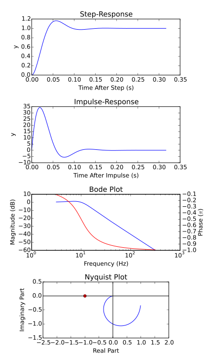

tanuna
++++++

tanuna provides tools to work with dynamic systems. This includes

* continuous- and discrete-time systems
* linear and non-linear systems
* time-independent and time-varying systems
* Single-Input Single-Output (SISO) and Multiple-Input Multiple-Output (MISO) systems

In the following, we will explain how to:

* create systems
* analyze systems
* solve systems
* combine systems

=========
Diving In
=========

Let's start with some examples based on a continuous-time, second-order LTI SISO system:

.. testsetup::

	import sys
	sys.path.append('..')

.. testcode::

	import tanuna as dyn
	import numpy as np

	w0 = 2 * np.pi * 10
	zeta = 0.5
	k = 1.

	A = np.matrix([[0, w0], [-w0, -2*zeta*w0]])
	B = np.matrix([0, k*w0]).T
	C = np.matrix([k, 0.])
	D = np.matrix([0.])

	G = dyn.CT_LTI_System(A, B, C, D)

This creates the system G from state-space matrices A, B, C, D. The system provides some interesting information:

.. testsetup:: LTI_G

	import tanuna as dyn
	import numpy as np
	import matplotlib.pyplot as pl

	w0 = 2 * np.pi * 10
	zeta = 0.5
	k = 1.

	A = np.matrix([[0, w0], [-w0, -2*zeta*w0]])
	B = np.matrix([0, k*w0]).T
	C = np.matrix([k, 0.])
	D = np.matrix([0.])

	G = dyn.CT_LTI_System(A, B, C, D)

.. doctest:: LTI_G

	>>> G.stable
	True
	>>> G.poles
	array([-31.41592654+54.41398093j, -31.41592654-54.41398093j])
	>>> G.reachable
	True
	>>> # Reachability matrix:
	... G.Wr
        matrix([[    0.        ,  3947.84176044],
                [   62.83185307, -3947.84176044]])
	>>> G.observable
	True
	>>> # Observability matrix:
	... G.Wo
        matrix([[  1.        ,   0.        ],
                [  0.        ,  62.83185307]])

Furthermore, it calculates step- and impulse-responses, Bode- and Nyquist-plots:

.. testcode:: LTI_G

        pl.figure()

        # STEP RESPONSE
        pl.subplot(4, 1, 1)
        pl.title('Step-Response')
        pl.plot(*G.stepResponse())
        pl.xlabel('Time After Step (s)')
        pl.ylabel('y')

        # IMPULSE RESPONSE
        pl.subplot(4, 1, 2)
        pl.title('Impulse-Response')
        pl.plot(*G.impulseResponse())
        pl.xlabel('Time After Impulse (s)')
        pl.ylabel('y')

        # BODE PLOT
        ax1 = pl.subplot(4, 1, 3)
        ax1.set_title('Bode Plot')
        f, Chi = G.freqResponse()
        ax1.semilogx(f, 20 * np.log10(np.abs(Chi[0, 0])), r'b-')
        ax1.set_xlabel('Frequency (Hz)')
        ax1.set_ylabel('Magnitude (dB)')
        ax2 = ax1.twinx()
        ax2.semilogx(f, np.angle(Chi[0, 0]) / np.pi, r'r-')
        ax2.set_ylabel('Phase ($\pi$)')

        # NYQUIST PLOT
        ax = pl.subplot(4, 1, 4)
        pl.title('Nyquist Plot')
        pl.plot(np.real(Chi[0, 0]), np.imag(Chi[0, 0]))
        pl.plot([-1], [0], r'ro')
        pl.xlim([-2.5, 2])
        pl.ylim([-1.5, 0.5])
        ax.set_aspect('equal')
        pl.axhline(y=0, color='k')
        pl.axvline(x=0, color='k')
        pl.xlabel('Real Part')
        pl.ylabel('Imaginary Part')

The duration of the trace and the density of samples is automatically determined for you based on the Eigenvalues of the system (but you can provide your own if you prefer).

System-algebra is supported: You can connect systems in series, in parallel (creating a MIMO system from 2 SISO systems for example), and in feedback configuration:

.. doctest:: LTI_G

	>>> # Connect G in series with G:
	... H = G * G
	>>> # Connect G in parallel with G:
	... J = G + G
	>>> # This is the same as 2 * G:
	... G + G == 2 * G
	True
	>>> # Check number of inputs and outputs:
	... (2 * G).shape
	(1, 1)
	>>> G.shape
	(1, 1)
	>>> H.shape
	(1, 1)

.. [feedback_systems] Karl Johan Åström and Richard M. Murray, "`Feedback Systems`_", Princeton University Press, 2012

.. _Feedback Systems: http://www.cds.caltech.edu/~murray/books/AM08/pdf/am08-hyperref_28Sep12.pdf

